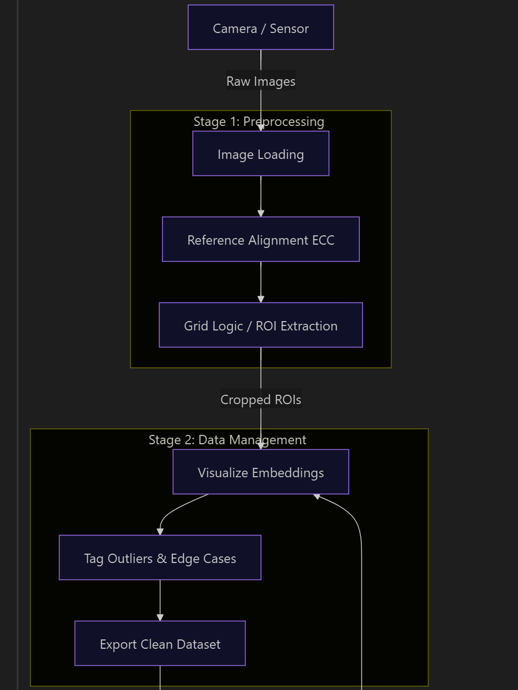
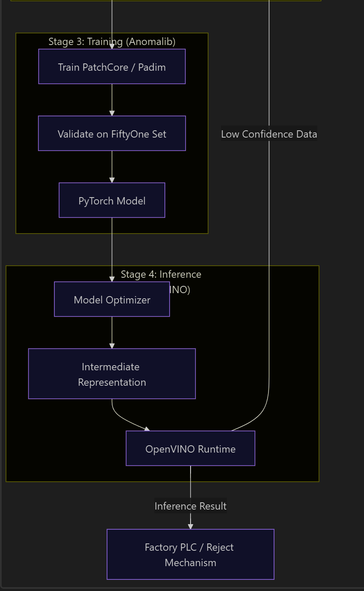

# ANOMALY DETECTION 
- 30% Full Grid Images: To validate performance on the actual target view.
- 70% Single/Cropped Images: Great for quickly boosting the dataset volume and balancing `"Pass"` vs `"Fail"` classes.
## System Architecture
- Alignment: OpenCV
- Data Curation: FiftyOne
- Defect Model: Anomalib (Unsupervised)
- Deployment: OpenVINO

